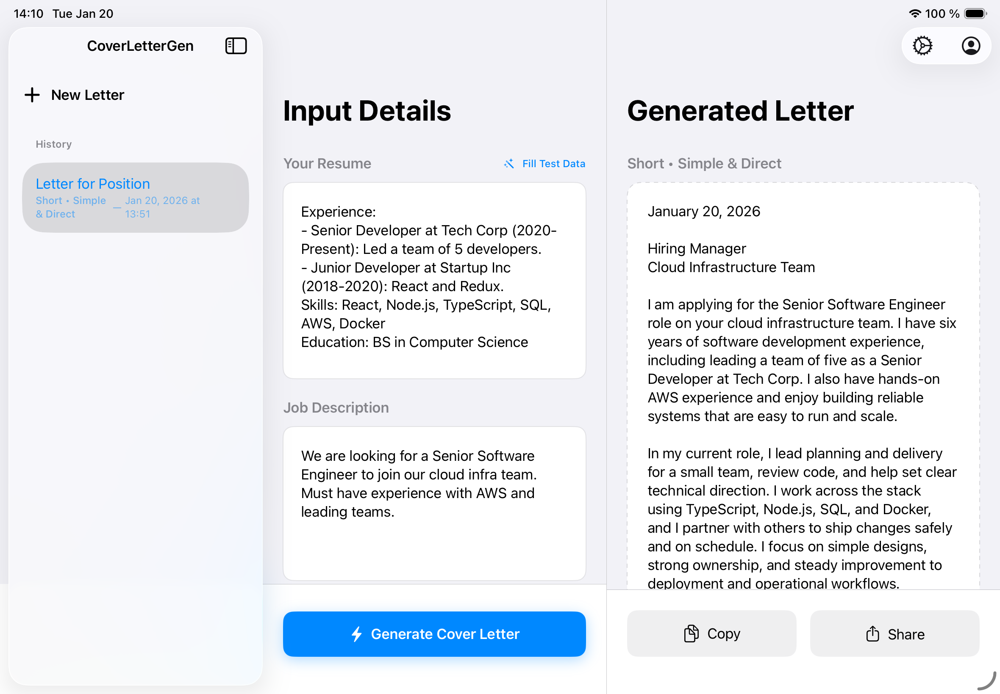

# CoverLetterGen

An AI-powered iPad application that generates tailored cover letters using SwiftUI and SwiftData.

## Features
- **Privacy-First**: Your personal profile data (Name, Contact, Address) is stored **locally** and never sent to OpenAI. It is added to the letter on-device.
- **Advanced AI**: Powered by OpenAI's **GPT-5.2 Responses API** for strict adherence to length and tone instructions.
- **Smart Persistence**: Auto-saves every letter to **SwiftData**, including the exact **Length** and **Tone** settings used to generate it.
- **Instant Restore**: Selecting a letter from history instantly restores your global app settings to match that letter.
- **Refined UI**: Clear visual feedback on generation settings (e.g., "Short • Professional") and a clean, artifact-free reading experience.
- **iPad Optimized**: 3-column layout for maximum productivity.

## Tech Stack
- **Language**: Swift 6 (Strict Concurrency)
- **UI Framework**: SwiftUI (NavigationSplitView, MVVM)
- **Persistence**: SwiftData
- **Networking**: URLSession async/await
- **AI**: OpenAI API

## Setup
1. Clone the repository.
2. Open `CoverLetterGen.xcodeproj` (or the folder in Swift Playgrounds).
3. Run on iPad Simulator or Device, then navigate to App Settings.
4. Tap the **Settings** (gear icon) in the sidebar to enter your OpenAI API Key.

## Requirements
- iOS/iPadOS 17.0+
- Xcode 15+
