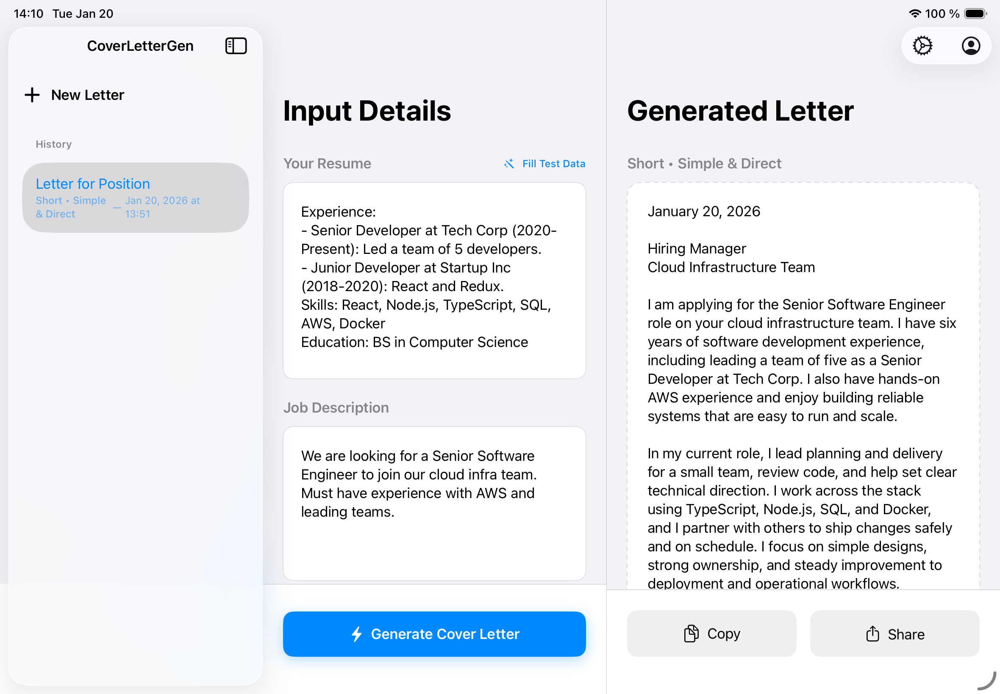

# CoverLetterGen


CoverLetterGen is a native iPadOS app for drafting tailored cover letters from a resume and job description. I built it as a practical SwiftUI project with a focus on clean architecture, local privacy, Swift 6 concurrency, and testable OpenAI API integration.

The app keeps the workflow simple: paste a resume, paste a job description, choose a length and tone, then generate a cover letter that can be reviewed, copied, and saved in local history.

## Project Highlights

- **Swift 6** project configuration across the app, unit test, and UI test targets.
- **SwiftUI + MVVM** structure with views kept focused on presentation and `AppViewModel` handling app state and user actions.
- **SwiftData persistence** for generated cover letter history.
- **OpenAI Responses API** integration through a dedicated actor-based service.
- **Privacy-conscious generation flow** that keeps user contact details local instead of sending them to the model.
- **Dependency injection** around OpenAI generation so the main workflow can be tested without live network calls.
- **Deterministic unit tests** covering generation behavior, persistence updates, API response parsing, and error handling.

## Tech Stack

| Area | Implementation |
| --- | --- |
| Language | Swift 6 |
| UI | SwiftUI |
| Architecture | MVVM |
| State observation | Observation |
| Persistence | SwiftData + UserDefaults |
| Concurrency | async/await, actors, `@MainActor` |
| Networking | URLSession + Codable |
| API | OpenAI Responses endpoint |
| Tests | XCTest, in-memory SwiftData, `MockURLProtocol` |

## Architecture

The app is organized around a small MVVM structure:

- **Views** render the interface and forward user actions.
- **AppViewModel** owns screen state, validation, generation orchestration, and SwiftData updates.
- **OpenAIService** is an `actor` that handles network requests and response parsing.
- **Models** define persisted cover letters and the selectable length/tone options.

This keeps the UI layer lightweight while still making the generation flow easy to follow and test.

## Privacy Approach

Cover letters often include personal details, so the app separates model generation from local assembly:

1. **Generated remotely**: resume text, job description, tone, and length instructions are sent to OpenAI.
2. **Kept local**: name, email, phone, address, and portfolio details are stored locally in `UserDefaults`.
3. **Assembled on device**: the generated letter is combined with the local profile header after the API call returns.
4. **Saved locally**: finished cover letters are stored with SwiftData on the device.

This design reduces unnecessary PII exposure while preserving a polished final document.

## Swift 6 Concurrency

The project is configured for Swift 6 and uses modern concurrency patterns:

- `OpenAIService` is an `actor`, which isolates network client state.
- `AppViewModel` is `@MainActor`, keeping UI-facing mutations on the main actor.
- Generation requests snapshot the selected letter, resume, job description, tone, length, and local profile header before awaiting the API call.
- Test doubles use actor isolation or thread-safe storage so the test target also builds cleanly under Swift 6.

The snapshotting is important: if a user starts generation and then selects another saved letter before the request finishes, the result is applied to the original letter instead of whichever item happens to be selected later.

## OpenAI Response Handling

The service uses strongly typed request and response models for the Responses API. The model is instructed to return JSON containing a title and cover letter, then the client parses the nested `output -> content -> output_text` structure.

```swift
let decodedResponse = try JSONDecoder().decode(ResponsesResponse.self, from: data)

if let firstOutput = decodedResponse.output.first,
   let textContent = firstOutput.content.first(where: { $0.type == "output_text" })?.text,
   let data = textContent.data(using: .utf8),
   let json = try? JSONSerialization.jsonObject(with: data) as? [String: String],
   let title = json["title"],
   let content = json["cover_letter"] {
    return (title, content)
}
```

The app also has fallback handling for plain text responses, so the user is not left with an empty result if the model returns usable text that is not valid JSON.

## Persistence

Generated letters are stored with SwiftData using the `CoverLetter` model. Each saved item keeps:

- Resume text
- Job description
- Generated cover letter
- Selected length option
- Selected tone option
- Creation/update date

When a saved letter is selected, the app restores its input fields and generation settings. This makes the history useful as an editable workspace, not just an archive.

## Testing

The test suite is designed to avoid live API calls and external state:

- `AppViewModelTests` use an in-memory SwiftData container.
- A mock `OpenAIGenerating` actor verifies generation behavior without network traffic.
- `OpenAIServiceTests` use `MockURLProtocol` for deterministic API success and failure responses.
- The test target builds under Swift 6 with concurrency-safe test doubles.

Current local verification:

```sh
DEVELOPER_DIR=/Applications/Xcode.app/Contents/Developer xcodebuild test \
  -project CoverLetterGen.xcodeproj \
  -scheme CoverLetterGen \
  -destination 'platform=iOS Simulator,name=iPad (A16),OS=26.5' \
  -derivedDataPath /tmp/CoverLetterGenDerivedData \
  CODE_SIGNING_ALLOWED=NO \
  -only-testing:CoverLetterGenTests
```

Result: **12 unit tests passing**.

## Visuals



## Setup

1. Clone the repository.
2. Open `CoverLetterGen.xcodeproj` in Xcode 26.5 or newer.
3. Run the app on an iPad simulator or device.
4. Add an OpenAI API key in the app's settings screen.

If `xcode-select` points to Command Line Tools, SwiftData and Observation macro plugins may be unavailable from command-line builds. Use `DEVELOPER_DIR`:

```sh
DEVELOPER_DIR=/Applications/Xcode.app/Contents/Developer xcodebuild \
  -project CoverLetterGen.xcodeproj \
  -scheme CoverLetterGen \
  -configuration Debug \
  -destination generic/platform=iOS \
  -derivedDataPath /tmp/CoverLetterGenDerivedData \
  CODE_SIGNING_ALLOWED=NO \
  build
```

Or make Xcode the default developer directory:

```sh
sudo xcode-select -s /Applications/Xcode.app/Contents/Developer
```

## What This Project Demonstrates

This project shows how I approach small product-focused apps: keep the interface approachable, keep sensitive data local where possible, isolate network code, make state changes predictable, and write tests around the parts most likely to break.

## License

MIT
